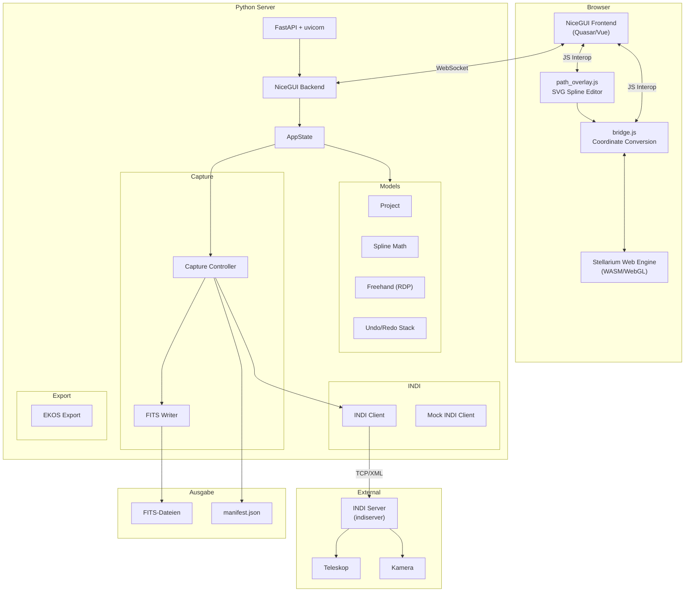
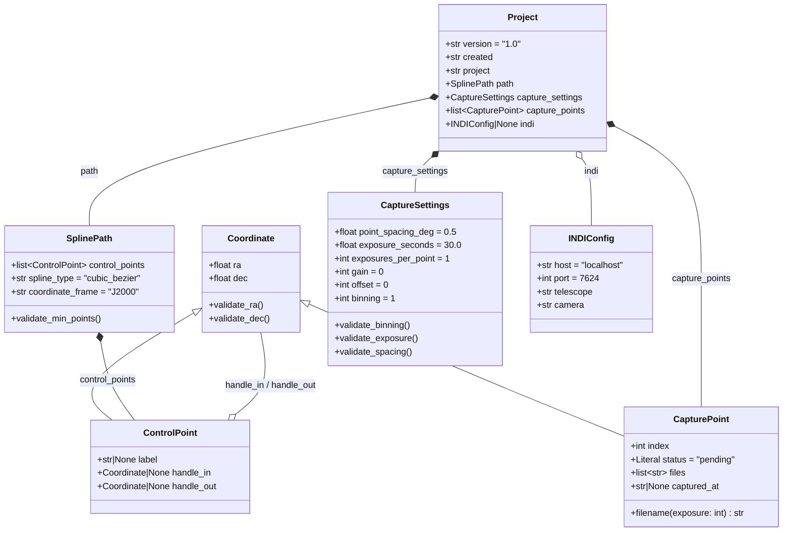
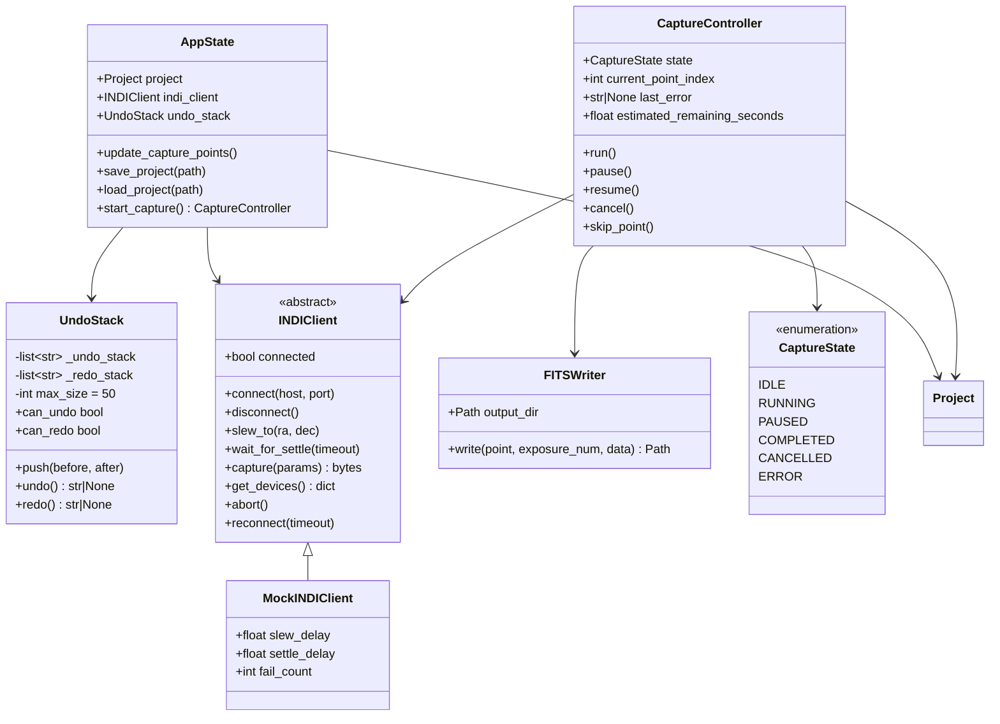
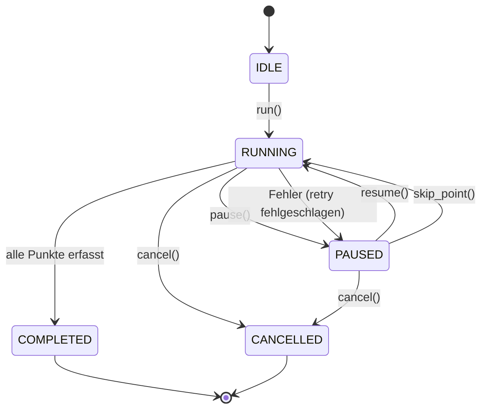
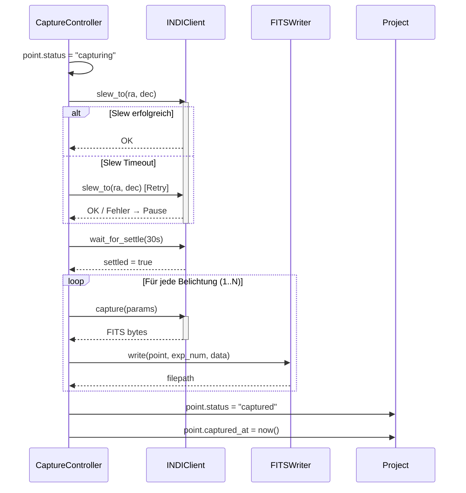
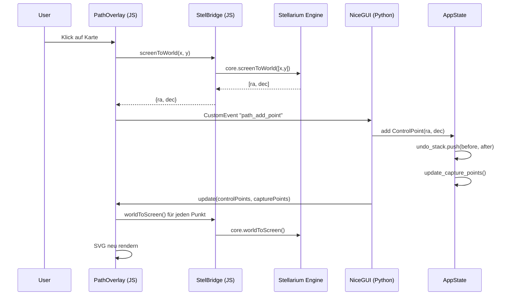
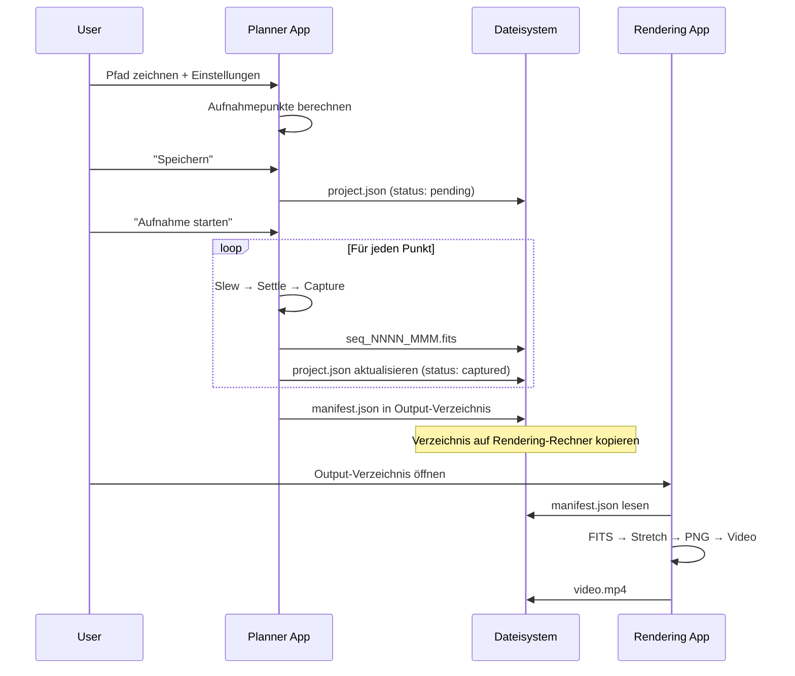

# Nightcrawler — Architecture (UML)

## 1. Komponentendiagramm

## 2. Klassendiagramm — Datenmodelle

## 3. Klassendiagramm — Anwendungslogik

## 4. Zustandsdiagramm — Capture Controller

## 5. Sequenzdiagramm — Aufnahme eines Punktes

## 6. Sequenzdiagramm — Pfad zeichnen (Browser ↔ Server)

## 7. Sequenzdiagramm — Projekt Lifecycle

## 8. UI-Layout Diagramm

```mermaid
graph TB
    subgraph "Browser Viewport"
        subgraph Toolbar["Toolbar"]
            Draw["Draw"]
            Freehand["Freehand"]
            Move["Move"]
            AddPt["Add Point"]
            RemPt["Remove"]
            Split["Split"]
            Sep1["│"]
            Undo["Undo"]
            Redo["Redo"]
            Sep2["│"]
            Save["Save"]
            Load["Load"]
            Export["EKOS"]
            Sep3["│"]
            Start["▶ Start Capture"]
        end

        subgraph StarMap["Sternkarte (Hauptbereich)"]
            SWE2["Stellarium Web Engine Canvas"]
            SVG["SVG Overlay (Spline + Punkte)"]
            CoordDisplay["RA/Dec Anzeige"]
        end

        subgraph BottomPanel["Bottom Panel (einklappbar)"]
            subgraph Collapsed["Eingeklappt"]
                Summary["Pfad: 3 ctrl / 8 capture │ 30s × 1 │ 0.5° │ ~4 min"]
            end
            subgraph Expanded["Ausgeklappt"]
                Settings["Einstellungen<br/>Abstand / Belichtung / Gain"]
                PointTable["Aufnahmepunkt-Tabelle<br/># │ RA │ Dec │ Status"]
                INDIPanel["INDI Verbindung<br/>Host │ Port │ Status"]
            end
        end
    end

    Toolbar --> StarMap
    StarMap --> BottomPanel
```

