# Nightcrawler — Architecture (UML)

## 1. Component Diagram — System Overview

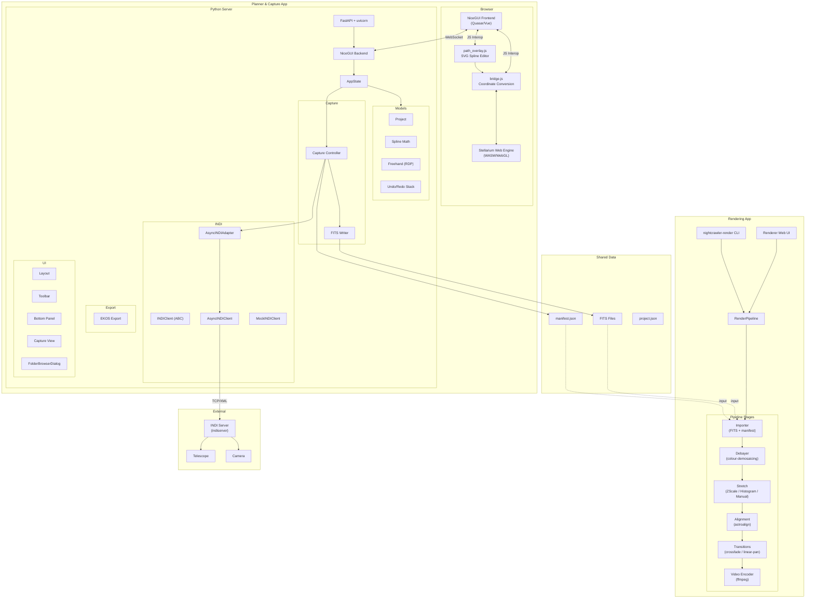

## 2. Package Diagram

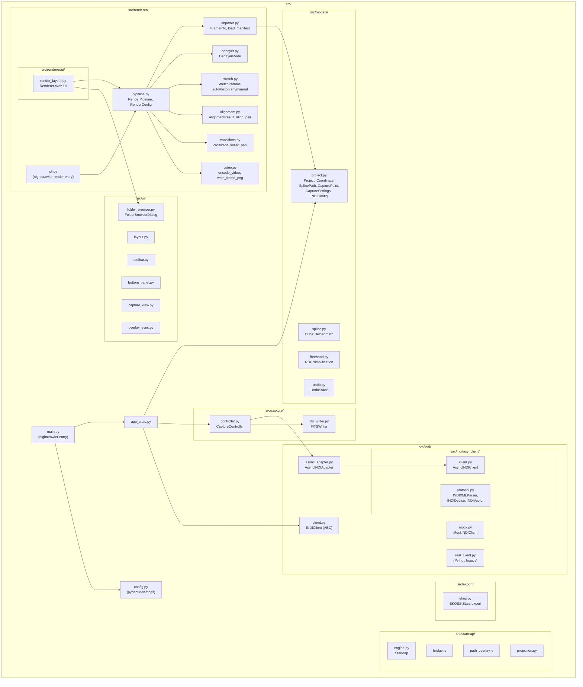

## 3. Class Diagram — Data Models (shared by Planner and Renderer)

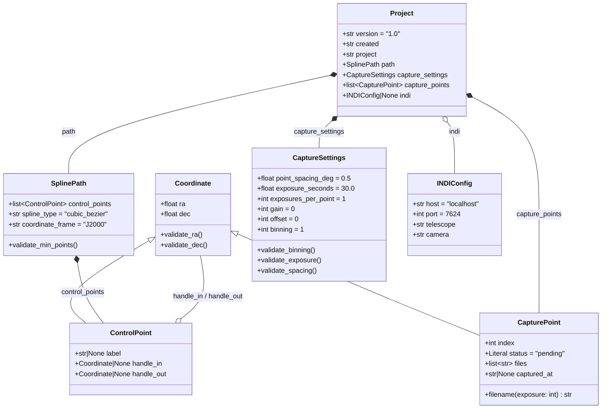

## 4. Class Diagram — Planner Application Logic

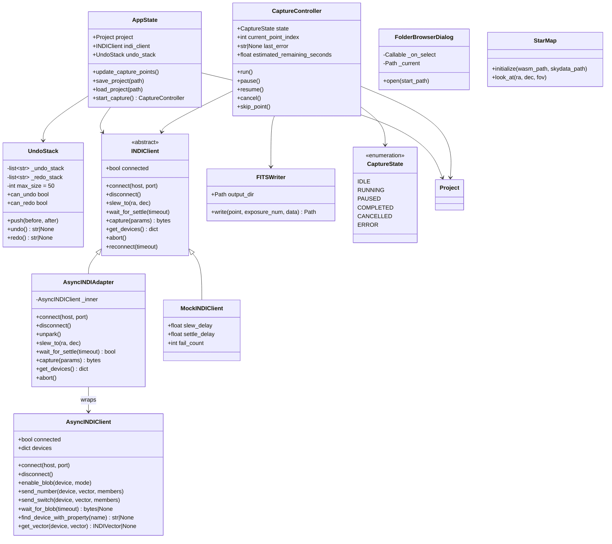

## 5. Class Diagram — Renderer

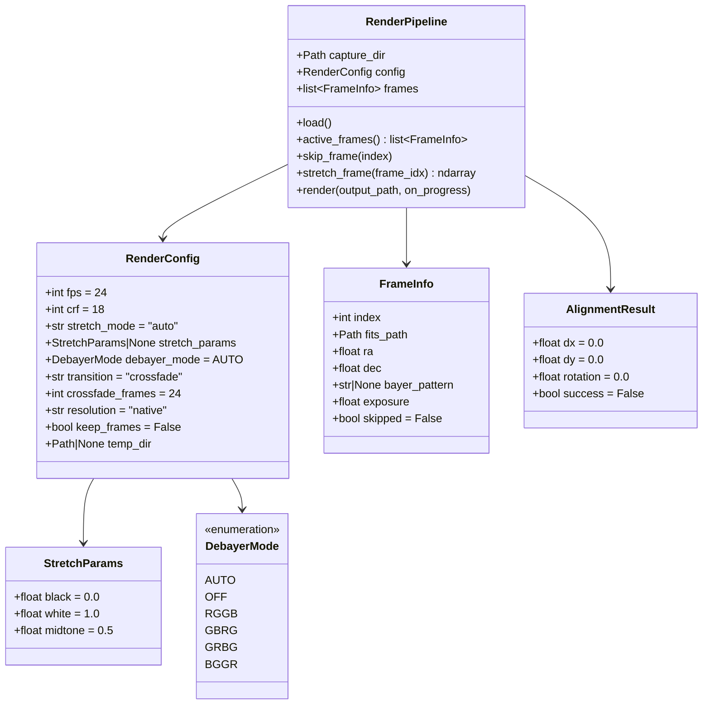

## 6. State Diagram — Capture Controller

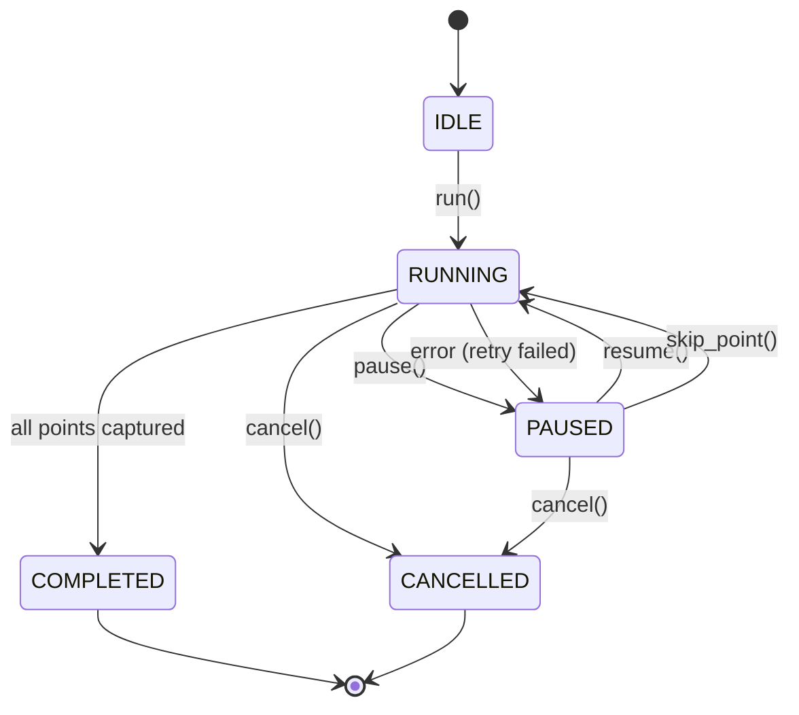

## 7. Sequence Diagram — Render Pipeline

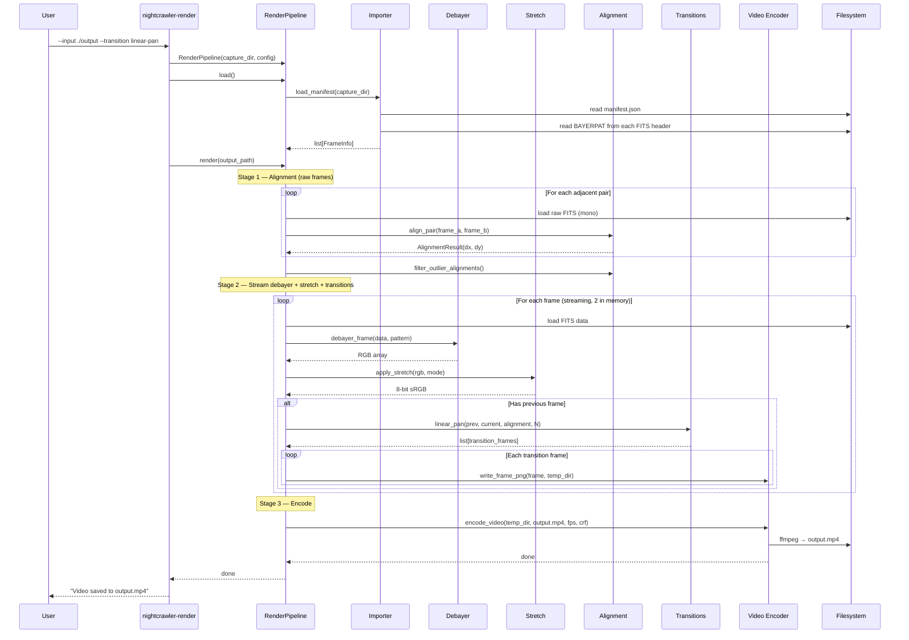

## 8. Sequence Diagram — Capture Flow

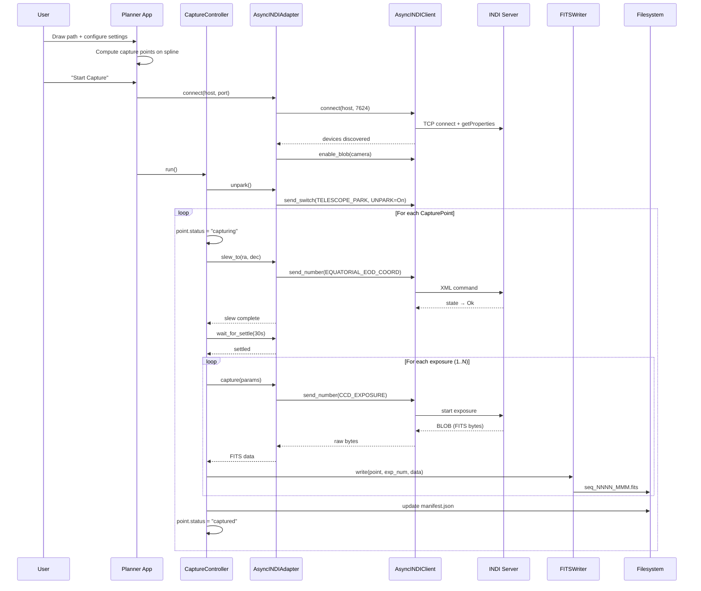

## 9. Sequence Diagram — Path Drawing (Browser <-> Server)

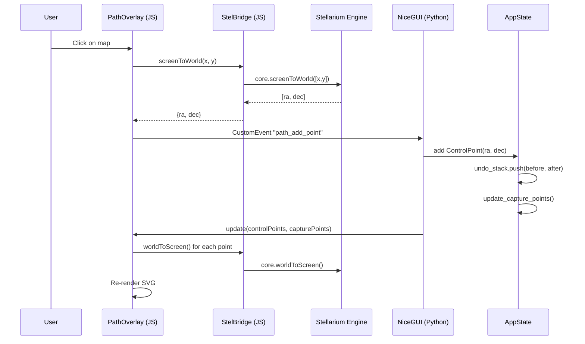

## 10. Sequence Diagram — Project Lifecycle

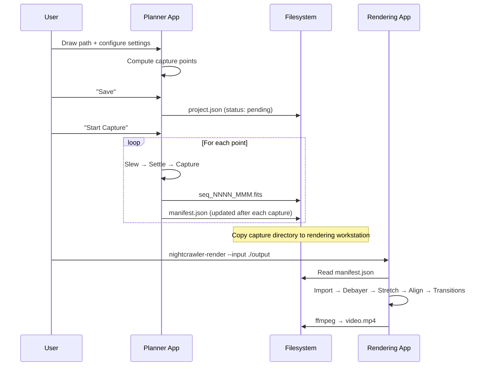

## 11. UI Layout — Planner

```mermaid
graph TB
    subgraph "Browser Viewport"
        subgraph Toolbar["Toolbar"]
            Draw["Draw"]
            Freehand["Freehand"]
            Move["Move"]
            AddPt["Add Point"]
            RemPt["Remove"]
            Split["Split"]
            Sep1["│"]
            Undo["Undo"]
            Redo["Redo"]
            Sep2["│"]
            Save["Save"]
            Load["Load"]
            Export["EKOS"]
            Sep3["│"]
            Start["▶ Start Capture"]
        end

        subgraph StarMap["Star Map (main area)"]
            SWE2["Stellarium Web Engine Canvas"]
            SVG["SVG Overlay (Spline + Points)"]
            CoordDisplay["RA/Dec Display"]
        end

        subgraph BottomPanel["Bottom Panel (collapsible)"]
            subgraph Collapsed["Collapsed"]
                Summary["Path: 3 ctrl / 8 capture | 30s x 1 | 0.5 deg | ~4 min"]
            end
            subgraph Expanded["Expanded"]
                Settings["Settings<br/>Spacing / Exposure / Gain"]
                PointTable["Capture Point Table<br/># | RA | Dec | Status"]
                INDIPanel["INDI Connection<br/>Host | Port | Status"]
            end
        end
    end

    Toolbar --> StarMap
    StarMap --> BottomPanel
```
